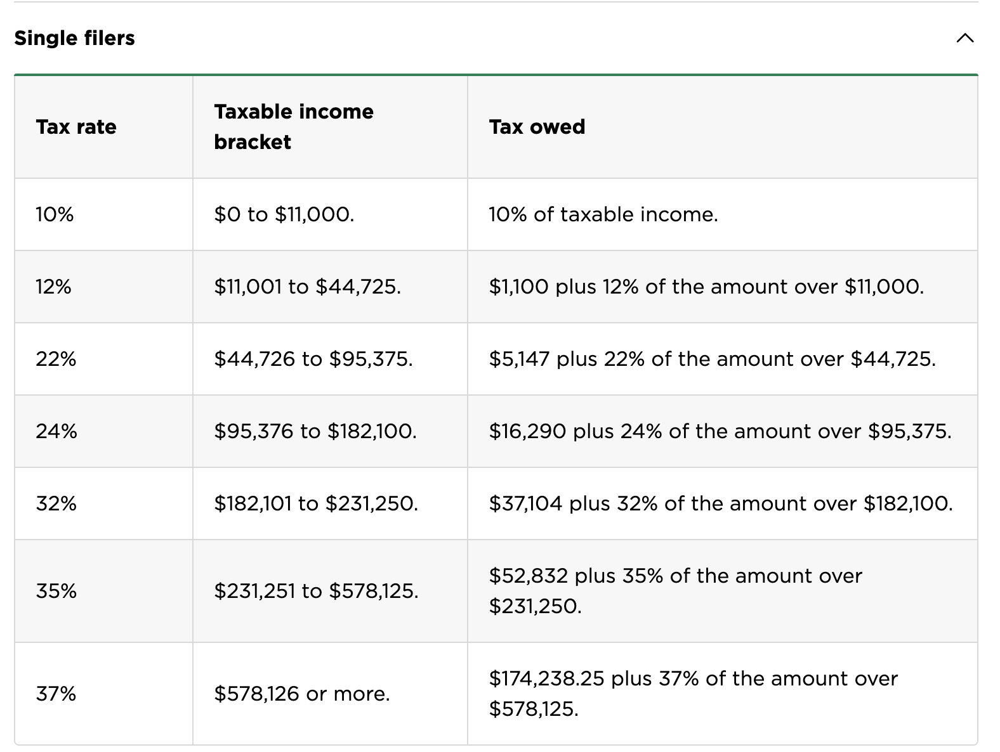

## Progressive Income Taxes

In the United States (as well as other locations), we have a progressive income tax system. What this means is that the percentage or amount you pay in taxes increases as your income increases, basically higher income individuals pay a larger percentage of their income in taxes. The word "progressive" is used to describe this tax system because the tax rate progresses as your income increases. I will not be going into the advantages and disadvantages or alternative tax systems in this post. You can read more about progressive tax systems on [investopedia](https://www.investopedia.com/terms/p/progressivetax.asp) if you're interested.

Although there are multiple nuances to calculating US federal income taxes we will not be going into detail on every aspect of calculating such taxes. Instead we will focus on the most basic examples and ignore things such as deductions. In the US there are different progressive tax brackets depending if you file as a single filer, married (filed jointly), married (filed separately), or the head of the household. For the purpose of this post we will only look at single filers for simplicity but this will all be applicable to any of the filing scenarios/personas. If we look at the [2023 tax brackets](https://www.nerdwallet.com/article/taxes/federal-income-tax-brackets) (taxes due in April 2024) we can see the following brackets for a single filer (courtesy of [nerdwallet.com](https://www.nerdwallet.com/))



There are a few important facts to be aware of regarding how progressive tax brackets work. The tax bracket rate you are in based on your income is not applied to all of your income. Your income is divided into taxable chunks. For example if you make $20,000 dollars based on the above tax brackets, the first $11,000 of your income is taxed at 10% and then the next $9,000 of that $20,000 is taxed at 12%. This logic can be applied to any level of income. The percentage of your taxable income that you end up paying in taxes is your effective tax rate (this will be less than the tax rate for your income bracket). This can be determined by dividing your total tax owed by your total taxable income. For example in the above scenario the total taxable income is `($11,000 * 0.10) + ($9,000 * 0.12) = $2,180` and then `$2,180 / $20,000 = 0.109` which is less than 12%. Now that we know the basics of calculating progressive income taxes let's hop into some code.

## Programmatically Calculating Progressive Income Taxes

While working on a [small side project to calculate ISO Taxes](https://isocalculator.com/) I needed to programmatically calculate taxes based on a progressive tax bracket. However I found it rather hard finding a library or an example algorithm to follow online, surely this must be a solved problem? I had multiple different tax brackets I wanted to calculate and I wanted a fairly generic algorithm that could do this based on a set of brackets passed in to avoid duplicate code. However, upon first glance most examples online were a series of if/else statements like [this one](https://github.com/rsjahnke/progressive-income-tax-calculator/blob/master/progressive_income_tax.php) and [this one](https://www.geeksforgeeks.org/income-tax-calculator-using-python/). This meant crafting multiple functions that were a series of if/else statements for each set of tax brackets. For example a function like this

```js
const calculateIncomeTax = (amount: number) => {
  if (amount <= 11000) {
    return amount * 0.1
  } else if (amount <= 44725) {
    return (amount - 11000) * 0.12 + 1100
  } else if (amount <= 95375) {
    return (amount - 44725) * 0.22 + 5147
  } else if (amount <= 182100) {
    return (amount - 95375) * 0.24 + 16290
  } else if (amount <= 231250) {
    return (amount - 182100) * 0.32 + 3104
  } else if (amount <= 578125) {
    return (amount - 231250) * 0.35 + 52832
  } else {
    return (amount - 578125) * 0.37 + 174238.25
  }
}
```

As you can imagine it is rather cumbersome to continuously type out these else if statements and you need to know not only the tax rates and top of brackets but also the amount of tax applied to your income at lower rates.

The good news is there is a fairly simple algorithm you can use to calculate taxable income based on a set of brackets passed in. Let's first see what this looks like in pseudocode before looking at actual code.

```
input: income amount, brackets which is a list of top of bracket amount and tax rate
output: taxed amount

taxed amount starts at 0
Loop over the brackets passed in
   If the income amount is greater than the top of the tax bracket
       Subtract max bracket amount of the previous bracket from current bracket and multiply that by the current bracket tax rate
       Add that amount to the tax amount value
   Else
       Subtract max bracket amount of the previous bracket from the income amount and multiple by the tax rate
       Add that to the tax amount value

return the total taxed amount
```

Now let's take a look at some actual javascript code for this algorithm

```js
export const calculateTaxAmount = (
  amount: number,
  brackets: { maxAmount: number, rate: number }[]
) => {
  let taxAmount = 0

  for (let index = 1; index < brackets.length; index++) {
    if (amount > brackets[index].maxAmount) {
      taxAmount +=
        (brackets[index].maxAmount - brackets[index - 1].maxAmount) *
        brackets[index].rate
    } else {
      taxAmount +=
        (amount - brackets[index - 1].maxAmount) * brackets[index].rate
      return taxAmount
    }
  }

  return taxAmount
}

export const federalTaxAmount = (amount: number) => {
  const brackets = [
    { maxAmount: 0, rate: 0 },
    { maxAmount: 10275, rate: 0.1 },
    { maxAmount: 41775, rate: 0.12 },
    { maxAmount: 89075, rate: 0.22 },
    { maxAmount: 170050, rate: 0.24 },
    { maxAmount: 215950, rate: 0.32 },
    { maxAmount: 539900, rate: 0.35 },
    { maxAmount: Infinity, rate: 0.37 },
  ]

  return calculateTaxAmount(amount, brackets)
}
```

As you can see we have the first tax bracket be an amount of 0 at a rate of 0. This allows us to start our for loop at the first index of the bracket and not run into an index out of range issue. And with that we have a simple algorithm for calculating progressive tax incomes! I've also pulled this algorithm into its own npm package for reuse by others called [us-taxes](https://github.com/jrusso1020/us-taxes). For now it exposes the above algorithm which is extensible with your own tax brackets and has a function for calculating federal taxes for the current tax year and previous tax year (2022 and 2023). Hopefully this post can save some others in the future looking to do this themselves. Something that would make this even easier in the future would be a free API for getting tax rates for a given year and filing status, however there doesn't seem to be such a free API currently. In the us-taxes npm package I had to manually input the tax brackets which makes it difficult to do for large ranges of years or different states.
