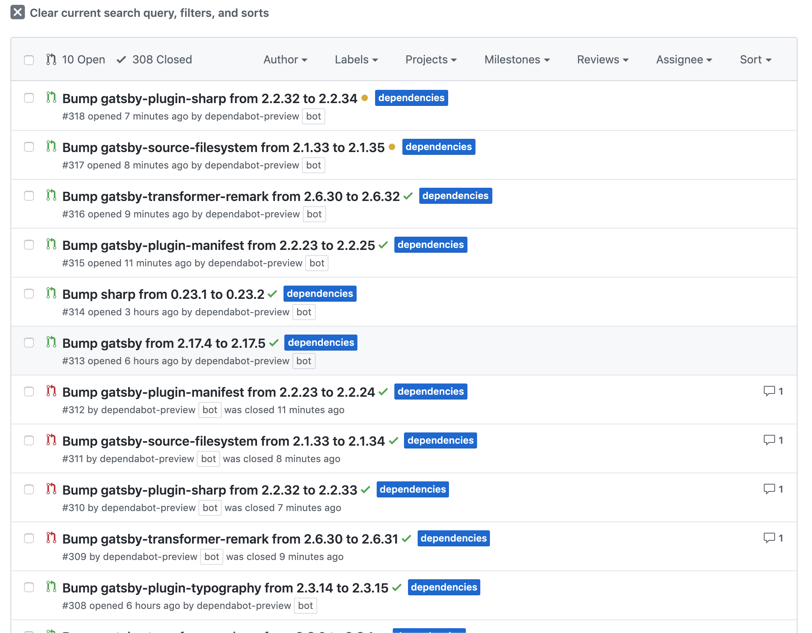
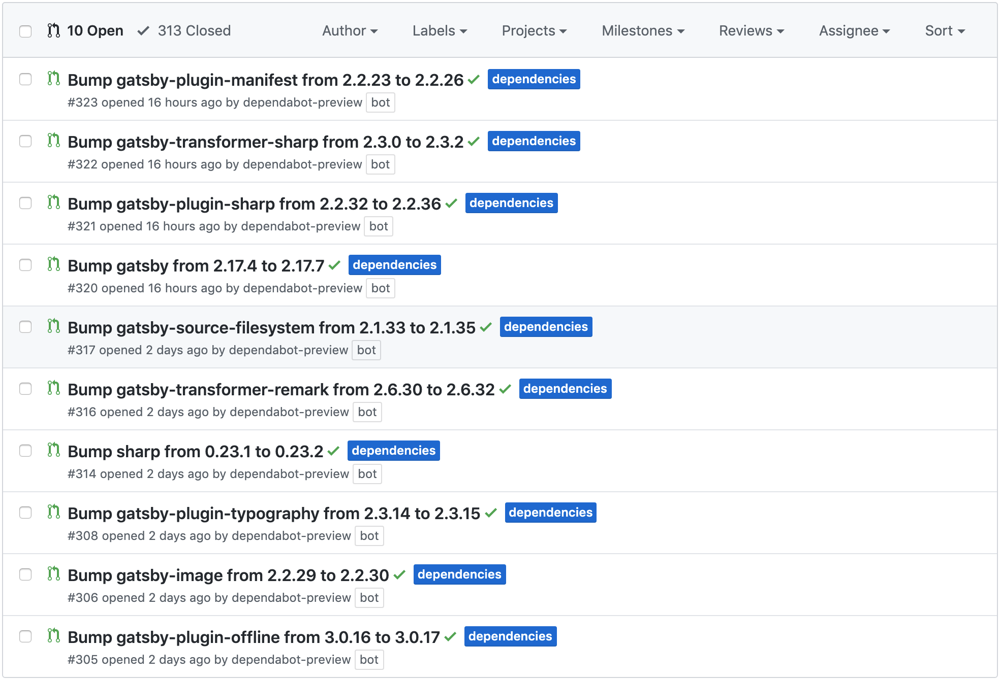

## Disclaimer
*Gatsby is a great framework that I utilize to build this website. Plugins are a vital part of that solution and I enjoy how they can expedite development of Gatsby websites. There are loads of great things I can say about Gatsby and its plugins. However, I think it's important to also realize the downfalls of technologies you like and use. So although this post is negative, I would definitely recommend Gatsby to others and advocate for it (in the right situations).*

Gatsby is a framework that utilizes React to build blazing fast statically generated websites and apps. Gatsby utilizes a plugin system to extend it's API for specific use cases. These plugins allow you to easily borrow a Node.js package that someone else developed to solve the same issue you might be encountering, allowing you to quickly build in complex functionality to your Gatsby site. There are pros and cons to this plugin ecosystem. Obviously a large pro is the ability to leverage common behaviors and quickly build features into your sites that someone else has already solved. However, a rather annoying can occur with Gatsby Plugins if you use a service like Dependabot to automatically check and update your dependencies in your app. For those who are not aware, Dependabot will check your dependency files for any outdated or insecure requirements and then automatically open up pull requests updating each dependency when needed. Shameless plug, [Dependabot](https://dependabot.com/) is a great service and since it's acquisition by Github, you can use Dependabot pro for free through Github so check it out to keep your dependencies up to date! However, Dependabot set to live updates plus Gatsby plugins can lead to a rather annoying experience. Gatsby maintains a large number of their own plugins and a lot of them get updated at the same time as you can see by the Dependabot PR’s opened in the below picture

Sometimes the plugins are updated in the same day leading Dependabot to close the old PR's and open new PR’s and closing the old outdated ones. This is pictured in the below image

And then Gatsby might update the same plugins a couple of days later, as you can see in the below picture if you look carefully

All of these PR's are from the repo that I use for this blog, which was started with the [Gatsby Starter Template](https://github.com/gatsbyjs/gatsby-starter-blog). So this is a pretty basic site, and I've added a few more plugins myself. Generally there's at least once a week where I get 10 PR's opened by dependabot, and there's some weeks where it happens multiple times a week or even a day. There was a period of time where I had two Gatsby repo’s I was maintaining and they shared a lot of plugins so this would occur in two different repos at the same time. Obviously if you have even more Gatsby repo’s you maintain this would continue to happen for all of them as well. This is a rather vicious cycle that consists of me having to merge in these PR's one by one, rebasing them after I merge in one, until they are all merged in. This process normally takes quite some time because I have to wait for my CI to pass before I can merge in each PR after it's rebased. When this happens multiple times a week this can take over an hour to merge in all the changes per repo.

## Is there something Gatsby could do better?
There are things I can do to combat this and I will discuss those in a bit. But I am curious if there isn't something Gatsby could do about this? Could they not release updates so often for all of their plugins? Is there a better way for them to manage their plugins so that you don't need to update them all so often? It's great to keep your dependencies up to date as much as possible to get new features, patch security risks, get performance updates, reduce maintenance of an old version, and many others. Nevertheless, there's also some drawbacks like encountering bugs that haven't been found yet, but let's not go into too much detail on the negatives here. So I try my best to keep my dependencies up to date by utilizing Dependabot, but then it leads me into this annoying routine of merging in, rebasing, and waiting for PR's. I will be honest and say I haven’t looked into the reason behind why so many of them get updated at the same time. This is something I plan to look into more, so that I can contribute a meaningful approach to a better solution if one is possible. I continue to manually update them though for the time being, even though it is a time consuming task.

## Is there something I could do better?
There are a few different things that I have thought of that would make this better for myself. The first option would be to change my Dependabot settings so that I don't get updates so often. However, this could still lead me to have to get around 10 PR's opened at one time (or even more), just at less often intervals. This would also mean I wouldn't be updating my dependencies as often which would lead me to miss out on the benefits I named above.

One option could be to turn off dependabot for these updates or just update them all in one PR manually when I see the PR's opened. What I mean by this is instead of merging in all of these PR's one by one once they are opened, I could see them opened then manually run `npm update` in my project so I update all my outdated packages at once. Then just merge in this one new set of changes all at once instead of one by one. Dependabot would notice the packages were updated and the PR's were out of date so then it would close them all. However, this probably isn't the best practice for a number of reasons. One big reason is that if I update all of the packages at once and one of them introduces a breaking change I would need to roll back the updates and do them one by one anyways to see which one was the breaking change. This is probably not a good approach to use if I can avoid it.

Another and more viable option would be to use a tool to automatically merge in these PR's when they are up to date and passing CI. Dependabot should take care of automatically rebasing the PR's when they get out of date which is great. There are a few tools out there form a quick search that can be integrated with Github or you could even use Github Actions to automatically merge in PR's that match certain criteria. I'd be curious to hear more about any free options out there that people are using to do this, so please feel free to comment below and let me know of any such tools. I'd be happy to give them a try to try and get out of this annoying situation. I think this will most likely be my approach once I’ve found time to vet some different solutions and hopefully integrate it into my repo. Hopefully I can come back here and update this blog with a solution once I’ve implemented it and save anyone else from this annoyance who might encounter it.

## My solution
After writing this post in full (but before posting) I stumbled upon a [Dependabot feature for automerging](https://dependabot.com/blog/automatic-pull-request-merging/) that I was not aware of before. I think a lot of my problems could have been solved had I done some proper googling earlier. You can turn on auto merging in your account settings which will then allow you to enable it on a per project basis. You can set the level of dependency updates that you want to merge in automatically and Dependabot will merge them in for you assuming all of your status checks pass. I’ll give this a go and see how things go, hopefully it saves me some time. But like I said, I would be curious to hear what other approaches people use for this as well. There may be drawbacks to this approach so I may revisit this post in the future for any updates.
