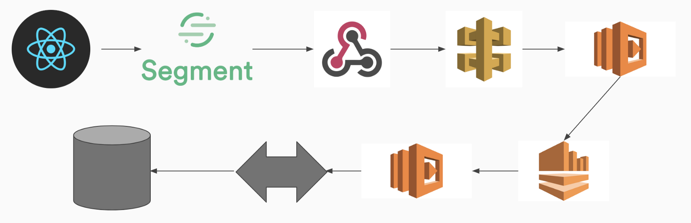

As a data-driven eCommerce company, Rockets of Awesome deals with tens of thousands of segment events everyday. And although segment handles sending these to most outside services, there are certain instances when we want to update our model attributes based on frontend events. So in order to handle this process we built a Segment Drain. Our Segment Drain filters our segment events for the ones we want and then forward these events along to our eCommerce store. We wanted to stream this frontend information to our backend reliably and as quickly as possible so we utilized some AWS services such as API Gateways, Lambdas, and Kinesis Data Streams.

### Architecture
The overall architecture of our system relies on a few different systems.


### Segment.io
The first system in our architecture is our frontend client. Our react client is our of our sources for segment events. We create event using segments analytics javascript library, which pushes events to Segment. This allows us to forward events to our different destinations. We can create multiple destinations for our segment events to be pushed too. The one that is important to us for this Segment Drain is the web-hook destination. Using the web-hook destination, we can forward all of our segment events to our AWS services to be processed.

### AWS
Our AWS architecture is split up into 4 parts
The first part of the architecture is the API Gateway. The API Gateway is the "Front Door" for other services/applications. Amazon API Gateway handles all the tasks involved in accepting and processing up to hundreds of thousands of concurrent API calls. In our case we are using our API Gateway as a proxy for our Lambda. This basically just means that we use it to forward requests from our web-hook to our first Lambda function. It acts as a broker of HTTP requests from the web-hook to the lambda function.
Next in the architecture is our first Lambda function. We have two different Lambda functions in our architecture. For those who aren't already aware, Lambda functions are blocks of code that we can run without having to provision or manage servers. Lambda functions have a second added benefit of only having to pay for the time your code is running. Our first Lambda function acts as a filtering system. We use it to only forward on the segment events that we care about instead of having to run all of our events through our entire data pipeline. So our Lambda function has a list of the events we will want to forward on, and then publishes these events to our Kinesis Stream, discarding all unnecessary events. This has the benefit of limiting the load that we put on our Kinesis Stream and the rest of our system in general.
Here is our Lambda for filtering and forwarding events to our Kinesis Stream:
```javascript
'use strict';
var AWS = require('aws-sdk');

const events = require('./forwardable_events');
const kinesisConstants = require('./kinesisConstants');

exports.handler = (event, context, callback) => {
  var response = {
    statusCode: 200,
    body: ''
  };

  const kinesis = new AWS.Kinesis({
    apiVersion: kinesisConstants.API_VERSION,
    region: kinesisConstants.REGION
  });

  const findEvent = (eventName) => {
    return events.FORWARDABLE_EVENTS.hasOwnProperty(eventName)
        && events.FORWARDABLE_EVENTS[eventName]['enabled'];
  }

  const savePayload = (payload) => {
    var params = {
      Data: JSON.stringify(body),
      PartitionKey: kinesisConstants.PARTITION_KEY,
      StreamName: kinesisConstants.STREAM_NAME
    };
    kinesis.putRecord(params, function(err, data) {
      if(err) {
        response.statusCode = 500;
        response.body = 'error recording to Kinesis stream';
        console.error(response.body);
        callback(response);
      } else {
        response.body = 'message recorded to Kinesis stream';
        console.info(response.body);
        callback(null, response);
      }
    });
  }

  let body = JSON.parse(event.body);
  var valid = findEvent(body.event);

  const params = {
    StreamName: kinesisConstants.STREAM_NAME,
  };

  if (valid) {
    kinesis.describeStream(params, function(err, data) {
      if (err) {
        response.statusCode = 500;
        response.body = JSON.stringify(err);
        callback(response);
      } else {
        //Make sure stream is able to take new writes (ACTIVE or UPDATING are good)
        if(data.StreamDescription.StreamStatus === kinesisConstants.STATE.ACTIVE
          || data.StreamDescription.StreamStatus === kinesisConstants.STATE.UPDATING ) {
          savePayload(body);
        } else {
          response.statusCode = 500;
          response.body = 'stream not stable';
          callback(response);
        }
      }
    });
  } else {
    response.body = 'invalid event: ' + body.event;
    callback(null, response);
  }
};
```

The next part of our system is a Kinesis Stream. Amazon Kinesis Data Streams enable you to build custom applications that process or analyze streaming data for specialized needs. Kinesis Data Streams can continuously capture and store terabytes of data per hour. You can also emit data from Kinesis Data Streams to other AWS services such as Amazon Simple Storage Service (Amazon S3), Amazon Redshift, Amazon EMR, and AWS Lambda. In our case we emit our data to another Lambda function.

Our second Lambda function we use to forward all our filtered events to our backend system. This lambda function polls our Kinesis Stream for events, processes batches of events, and then uses HTTP requests to forward them to our message broker system.

Here is our Lambda that polls our Kinesis Stream and forwards the events:
```javascript
'use strict';
var request = require('request');

exports.handler = (event, context, callback) => {
  event.Records.forEach(function(record) {
    var json = JSON.parse(new Buffer(record.kinesis.data, 'base64').toString('utf8'));

    var options = {
      url: `${process.env.PUB_SUB_URL}events/segment_drain`,
      method: 'POST',
      headers: {
        'Content-Type': 'application/json',
        'Authorization': `Bearer ${process.env.PUB_SUB_AUTH_TOKEN}`
      },
      json: json
    };

    request(options, function(err, res, body) {
      if (res && (res.statusCode === 200 || res.statusCode === 201)) {
         context.succeed(res);
       } else {
        context.fail(res.statusCode);
       }
    });
  });
};
```

### Message Broker
Our backend system has two components in this pipeline. One is a pub-sub message broker system that we use to handle all events being dispatched between our eCommerce store and outside resources(such as Segment). So our last Lambda function forwards all events to this system which then passes the event along to our eCommerce store.

### eCommerce Store
Our eCommerce store is built on Ruby on Rails, so it has a special controller that handles all our segment events. Each type of segment event we have has a special event class that tells our eCommerce store what to do with the payload. We accomplish this by creating a registry that registers a class for the event we want to process, and we can tell which class handles which events. We register each of our events in the registry in `config/initializers/segment_events.rb`. This allows our app to know all the registered events on load. Our controller gets the proper event class from our registry using the event type, and then each event class implements a `process` method that handles the payload and updates the appropriate models in our database, as well as running any other code that processes the event.

Here is our code for our controller, registry, and events:
#### Controller
```ruby
module Api
  module V1
    class SegmentController < Api::ApplicationController
      before_action :authenticate_api_token!

      def create
        Segment::EventRegistry.klass_for(params[:event]).new(params).process
        head :created
      end
    end
  end
end
```

#### Event Registry
```ruby
module Segment
  module Registry
    def self.included(base)
      base.send(:extend, ClassMethods)
    end

    module ClassMethods
      def klasses(options = {})
        self.default = options.fetch(:default)
        self.registry = {}
      end

      def register(klass)
        registry[klass.event_name] = klass
      end

      def klass_for(event)
        registry.fetch(event.to_sym) { default }
      end

      private

      attr_accessor :registry, :default
    end
  end
end
```

#### Registry
```ruby
module Segment
  class EventRegistry
    include Segment::Registry

    klasses default: Segment::Events::BaseEvent
  end
end
```

#### Base Event
```ruby
module Segment
  module Events
    class BaseEvent
      attr_reader :payload

      def initialize(payload)
        @payload = payload
      end

      # return nil when not implemented
      def process; end

      def properties
        payload[:properties]
      end

      def self.event_name
        name.demodulize.underscore.to_sym
      end
    end
  end
end
```

#### Registered Events
```ruby
# All registered segment events we want to process
Segment::EventRegistry.register(Segment::Events::RegisteredEvent)
```

And now we are ready to process and store streaming information from Segment events in our eCommerce store's database!
