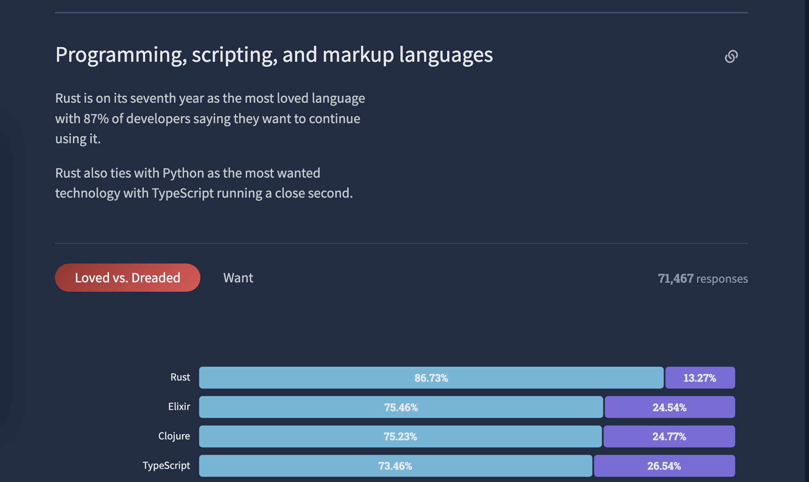
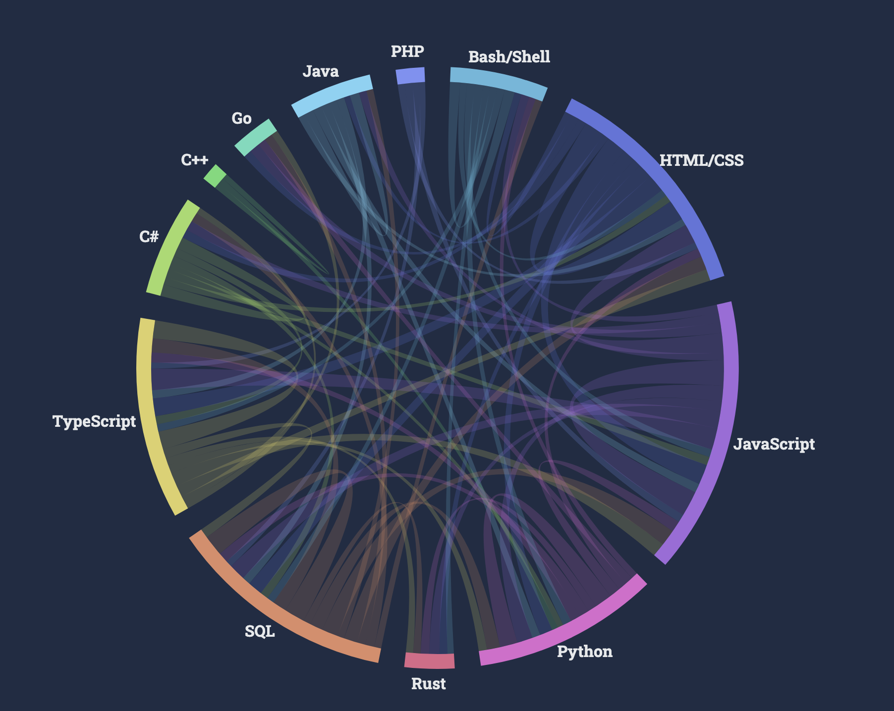

## Disclaimer

_I'd like to start off by stating that this blog post is my own thoughts. It does not reflect the ideas and thoughts of Brex. You can read more about Brex's decision in this [engineering blog post](https://medium.com/brexeng/building-backend-services-with-kotlin-7c8410795e4b) by Pratik Tandel. That being said, some of what I'm about to talk about will echo the other blog post._

## Introduction

As I've mentioned on this [blog previously](/one-year-of-elixir), I've worked in Ruby prior to joining Brex and really enjoyed the experience so I was excited to learn Elixir. Even before joining I took some time to play around with and learn the language so I could hit the ground running. Prior to my professional career, I took a course in college entitled "Data Structures and Functional Programming" where we learned about functional programming concepts while coding in OCaml. So even before Elixir I had some experience with functional languages and rather enjoyed the different programming paradigm and thought process.

While at Brex, I was a member of a volunteer team dedicated to maintaining Elixir libraries and documentation as well as onboarding and upleveling engineers in Elixir. I developed and led an onboarding class around Elixir general information and Brex custom Elixir knowledge which was given to hundreds of onboarded engineers. While I no longer get to code in Elixir in my day to day work at Brex, I always enjoyed programming in it and wanted it to be loved and enjoyed by others.

Nevertheless, it's been about two years since my last active Elixir development at Brex. Since then I have reflected back on some of the shortcomings of the language and our guidance around it. I touched on some of this in my previous post on [Elixir Learnings and Hiring](/elixir-learnings-and-hiring) but will try to cover some new topics. I hope this post can be utilized by the community and other adopters to ensure Elixir's future success.

## The Shortcomings

Although there were many reasons [why Brex initially chose Elixir](https://medium.com/brexeng/why-brex-chose-elixir-fe1a4f313195), over time there were also a number of issues that ended up slowing us down. The following are some of my observations on our shortcomings while using Elixir. Not all of these are issues with the language itself but rather issues with our use, guidelines, or lack thereof.

### Lack of Static Typing

There are lots of arguments for both dynamic and static typing. I won't be going into detail on all of the merits of each, but instead I'll focus on the shortcoming that a lack of static typing presents for us. Early on in a product development lifecycle dynamic typing allows you to iterate quickly by reducing the amount of code you need to write. But as you scale your codebase and your engineering team it can start to slow you down. Engineers have a harder time understanding code because the types of parameters or variables are not explicit and can take some time to trace. There are also a whole domain of bugs that can be avoided via static typing. Although tools like [Dialyxir](https://github.com/jeremyjh/dialyxir) can be used to perform static analysis and catch type definition issues in Elixir, it still requires you to define typespecs for your code. It is also quite easy for a team or project to be started without Dialyxir. If you skip out on static analysis of types early on and the codebase grows quite large then it will require a large effort to implement static type analysis fully to make it useful. One thing that definitely could have alleviated this issue for us a bit would have been utilizing typespecs and Dialyxir earlier on and enforcing their use. However the overall lack of static typing is hard to overcome completely and leads to the next shortcoming.

### IDE experience

As we onboarded more and more engineers a consistent complaint that came up with Elixir was the IDE experience. Developers coming from statically/well typed languages were used to a rich IDE experience with things like full autocomplete and easy refactoring to mention a couple. Our recommendation at the time was to use VS Code alongside the [Elixir language server](https://github.com/elixir-lsp/elixir-ls) which although is a pleasant experience for most is definitely not comparable to the full IDE experience of a statically typed language. It's also worth noting that if we had used typespecs and Dialyxir we probably would have improved the experience. Another potential issue is that we used docker containers for local development so engineers did not always have their local machine setup properly to utilize Elixir tooling fully locally. Something we could have attempted to devote more time to would have been ensuring a well documented IDE setup and local tooling setup, as well as potentially creating plugins or additional tooling for this local IDE setup.

### Dwindling Internal Support and Maintenance

Fairly early on Brex established a team that devoted a lot of effort to building internal Elixir libraries and speeding up developer productivity through shared "systems". However over time the focus of this team moved away from Elixir specific improvements and more so to building and maintaining shared systems such as an asynchronous event processing system. This left Elixir in a precarious position because no team was focused on its support and maintenance. Eventually we did create a virtual team of volunteers to attempt to take over support and maintenance but these engineers were on separate teams with other projects and focuses. It was not easy for them to prioritize larger Elixir work on top of their massive project load at a fast moving startup. Therefore Elixir and its libraries slowly degraded. Our Elixir version and Erlang versions became stationary at 1.8.1 and 22 respectively, which held us back from taking advantage of faster compilation and further improvements to the language. Similarly library dependencies were not upgraded, and internal libraries, documentation, and tooling were not maintained as they did not have clear ownership. Without dedicated owners the internal Elixir ecosystem became unmaintained.

### Tooling Integration and Build System

The last topic I'm going to cover is around Elixir's integration with other tools and its build system. First let's start off with a little context. At Brex we utilize a monorepo. Initially this monorepo had an Elixir umbrella app but we moved away from an umbrella to separate Elixir apps. We utilize [gRPC](https://grpc.io/) with [Protocol Buffers](https://developers.google.com/protocol-buffers) for interservice communication between our microservices, although this wasn't always true. Lastly we utilize [Bazel](https://bazel.build/) to build our applications within our monorepo, across multiple languages (for various reasons we have had some applications in python, typescript, and golang even before migrating to Kotlin).

In general Elixir's tooling is fairly great in isolation. Mix works well for managing dependencies, building, and testing your Elixir apps, but due to a variety of issues mix eventually became very slow to build some of our larger applications and in general could not produce reproducible builds. A couple of these reasons were due to us not upgrading Elixir/Erlang to take advantage of compiler optimizations as well as how we structured our protobuf elixir generated code as a single massive library.
There were two larger issues we encountered around the Elixir ecosystem integrating with our other tools. The first was around the lack of maturity in the [elixir-protobuf](https://github.com/elixir-protobuf/protobuf) library at the time (2 years ago) where it was originally only maintained by a single person. We ended up deciding to fork the elixir-protobuf library in order to implement some functionality we wished for, which made it harder to keep up to date with the upstream version. However, over the last two years Tubi and Community have sponsored the project and increased overall functionality and support of the library which is great!

The second large issue we ran into was around the lack of open source support for building Elixir with Bazel. In general Bazel relies on there being a defined set of rules to know how to build artifacts for different platforms/languages. For many mainstream languages there are already predefined rulesets maintained by a community or company, you can see lots of them in the[bazelbuild](https://github.com/orgs/bazelbuild/repositories?q=&type=all&language=&sort=) github org such as java, python, rust, nodejs, c++, etc. However as far as I'm aware, there is still to this day no open source set of Bazel rules for Elixir and as recent as Sept 2022 this was brought up on the [Elixir forum](https://elixirforum.com/t/elixir-and-bazel-google-s-open-sourced-monorepo-build-system/50345). In order to get around this issue we worked on an initial somewhat hacky version of rules for elixir which did not follow Bazel best practices, without getting into too much detail we dynamically generated build targets and directives in CICD as opposed to statically defining BUILD.bazel files and checking them in alongside our source code. This has meant that developers cannot utilize Bazel for local development flows like they can for every other language at Brex. Leading to developers remaining to use mix for Elixir and not able to take advantage of any Bazel build optimizations or tooling. Over the last year or so there has been an internal push though to improve our internal Elixir bazel rules so that we can get Elixir to a state where bazel files are checked into source code and bazel can be used for building and testing by developers as it is with other languages at Brex.

## What can we do?

So we’ve gone over a bunch of shortcomings we encountered, but what can be done? In general as I've already stated, I'm not here to say Elixir will never succeed at a large company. You can already see on the [Elixir website](https://elixir-lang.org/cases.html) a list of case studies of both startups and larger organizations adopting Elixir for different reasons and use cases. However, I do think that a part of what's missing from Elixir is larger company sponsorship and presence. If we look at the Stack Overflow 2022 Developer Survey](https://survey.stackoverflow.co/2022/#technology) results we can see that Elixir is clearly a loved language by those who use it coming in at number 2 even above typescript! And I echo the sentiment that Elixir is one of my favorite languages I've programmed in.

However it doesn't even appear in the list of languages used by developers professionally.

Golang and Rust both appear on the list of languages used by developers professionally and have been around for about as long as Elixir has. Rust and Elixir were both initially created in 2012 and Golang was created in 2009. This makes sense though as we have seen larger organizations like Google, Meta, etc get behind these languages. Golang was developed internally at Google which makes sense why Google has supported it. However, Rust was developed at Mozilla and has been adopted and supported by lots of organizations. You can see Meta talk about it's [history of using Rust](https://engineering.fb.com/2021/04/29/developer-tools/rust/) and in [2022 even going so far as to endorse it for server side use internally](https://engineering.fb.com/2022/07/27/developer-tools/programming-languages-endorsed-for-server-side-use-at-meta/). While there are lots of things to consider when discussing why these languages have been adopted by larger organizations and sponsored, it is mostly just to show languages of similar ages have been adopted professionally at a faster pace.

That being said, the point of this post is to help others avoid similar mistakes and help the community understand some shortcomings that can be improved for future adopters. Also some of the issues can be easily avoided or have been improved by the open source community already for future adopters. Hopefully over the years Elixir will start to show up in the Stack Overflow Developer Survey as one of the languages both loved and used by professionals.
